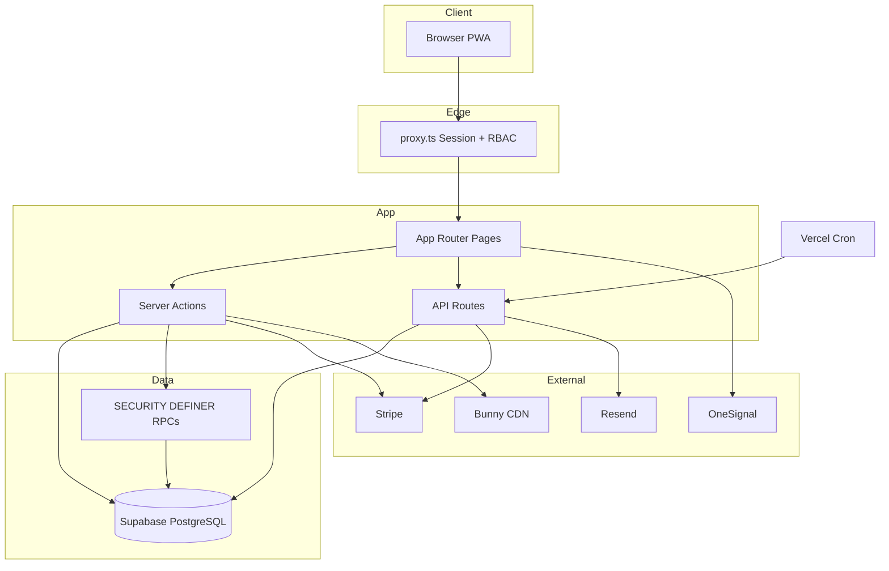

# Production Readiness Audit — HKCardVault

**Audit date:** 2026-09-08  
**Repository:** Pokemon-Card-Trading-Platform-Client  
**Branch reviewed:** `aaron-backend-wired` (HEAD at audit time)  
**Auditor mode:** Read-only — no production code modified  
**Stack:** Next.js 16.3.2 · React 19 · Bun 1.3.14 · Supabase · Stripe · Vercel

---

## Executive Summary

### Overall Status

**NOT PRODUCTION READY**

This repository has substantial engineering depth — 283 database migrations, ~47 server action modules, 107 Playwright specs, mature payment saga RPCs, and extensive gate scripts. However, **three database-layer privilege/economy vulnerabilities are exploitable today** by any authenticated user or signup attacker. Combined with weak main-branch CI (compile/lint only), conflicting certification SSOT, and large unknown-workflow gaps, launch would carry unacceptable security and financial risk.

### Production Readiness Score

| Dimension | Score (0–100) | Notes |
|-----------|---------------|-------|
| Architecture | 72 | Clear App Router + Server Actions split; service-role bypass debt |
| Functional correctness | 65 | Core checkout/escrow paths mature; home/settings stubs remain |
| User journeys | 68 | 67 registered features; many nightly-only or env-gated |
| Unknown workflows | 42 | Large gap matrix; double-submit / stale-state weakly covered |
| Database integrity | 32 | **CRITICAL** role/points escalation; public PII exposure |
| Security | 28 | **Blockers in RLS/RPC grants** outweigh passing E2E |
| Authentication | 76 | Supabase SSR + `proxy.ts` session refresh (Next.js 16) |
| Authorization | 52 | Admin page shell leaks; DB role UPDATE bypass |
| Error handling | 70 | Structured `{ success, error }` dominant; some RPC leak |
| Concurrency | 68 | Payment RPCs idempotent; checkout PI create lacks idempotency key |
| Testing | 54 | ~267 test files; **zero behavioral tests on `main` push** |
| E2E | 58 | 107 specs; L6 bundle documented failures/skips |
| Performance | 70 | No obvious N+1 crisis; some public-read overfetch |
| CI/CD | 38 | `ci.yml` ≠ documented production gate |
| Deployment | 64 | 13 Vercel crons; no `.env.example`; README stale |
| Observability | 22 | No Sentry/Datadog/structured logging platform |
| Maintainability | 58 | SSOT conflicts; 100+ scripts; doc drift |

### **Overall Production Readiness Score: 54 / 100**

> **Launch veto:** Any CRITICAL security or data-corruption finding overrides the numeric score. Three CRITICAL database findings mandate remediation before production.

### Critical Blockers (launch veto)

| ID | Finding | Domain |
|----|---------|--------|
| **CRIT-01** | Signup `handle_new_user` accepts `role` from `raw_user_meta_data` — admin injection | Database / Auth |
| **CRIT-02** | `profiles` UPDATE policy allows authenticated users to change `role` column | Database / AuthZ |
| **CRIT-03** | `fn_claim_mission_points` grants arbitrary `p_points` to any authenticated caller | Database / Economy |

### Major Risks (pre-launch)

- Public RLS on `kyc_records` (Stripe account IDs), `profiles` (FPS IDs), `platform_settings` (financial config)
- Points RPC abuse chain: `fn_grant_points_from_template`, `fn_redeem_member_points`
- Main GitHub CI runs **no Vitest/Playwright**; `build` not `build:ci`
- SSOT claims **67/67 certified** vs test SSOT **~27/67 staging-ready**
- Admin UI shell visible to non-admins (`/admin/layout`, settings, catalog, announcements list)
- Suspended users retain `/api/*` and server-action access
- Email/push notification delivery untested in any CI workflow
- No production observability (error tracking, alerting)

### Recommended Launch Decision

**DO NOT LAUNCH** until CRIT-01–03 are fixed, verified, and regression-tested. Run `test:production:gate:signoff` green on staging with real secrets. Reconcile SSOT before stakeholder sign-off.

---

## Phase 0 — Repository Discovery

### Tooling & Runtime

| Item | Value |
|------|-------|
| Package manager | Bun `1.3.14` (pinned) |
| Framework | Next.js `16.3.2`, App Router, Server Actions (50mb body limit) |
| Language | TypeScript strict |
| Styling | Tailwind CSS v4 (`app/globals.css` tokens, no `tailwind.config.*`) |
| PWA | Serwist (`@serwist/next`) |
| Tests | Vitest 4, Playwright 1.61, Stryker (weekly/signoff) |
| DB | Supabase PostgreSQL, 283 migrations, `types/supabase.ts` via `--linked` |

### Key paths

| Layer | Location |
|-------|----------|
| Routes | 60 `page.tsx`, 26 `route.ts` handlers |
| Server Actions | `app/actions/` (~47 modules) |
| Auth edge | `proxy.ts` (Next.js 16 Proxy/Middleware — **active**, build confirms `ƒ Proxy (Middleware)`) |
| Session | `lib/supabase/middleware.ts` → `updateSession()` |
| Admin client | `lib/supabase/admin.ts` (service role, server-only) |
| Cron | 13 routes in `vercel.json`, `lib/cron/request.ts` (Bearer `CRON_SECRET`) |
| Stripe | `lib/stripe.ts` (throws at import if key missing), webhook at `/api/stripe/webhook` |

### Environment variables (no `.env.example` committed)

**Required for production:** `NEXT_PUBLIC_SUPABASE_URL`, `NEXT_PUBLIC_SUPABASE_ANON_KEY`, `SUPABASE_SERVICE_ROLE_KEY`, `STRIPE_SECRET_KEY`, `NEXT_PUBLIC_STRIPE_PUBLISHABLE_KEY`, `STRIPE_WEBHOOK_SECRET`, `CRON_SECRET`, `NEXT_PUBLIC_SITE_URL`, `RESEND_API_KEY`, `RESEND_FROM_EMAIL`, Bunny CDN vars, OneSignal vars (if push enabled).

**Gap:** No committed env template — onboarding relies on scattered `docs/dev/follow-up/*/backend.md`.

### Documentation discrepancies

| Doc | Claims | Reality | Severity |
|-----|--------|---------|----------|
| `system-feature-registry.md` | 67/67 ☑, SC-FX-ALL certified | Optimistic vs test SSOT | **High** |
| `test-coverage-ssot.md` §0 | ~27/67 ☑, not staging-ready | More accurate | — |
| `README.md` | Supabase/Stripe "planned", mock data, Next 16.2 | Fully integrated; Next 16.3.2 | **High** |
| `.cursorrules` / `INTEGRATION_QUEUE.md` | `middleware.ts` | Implementation is `proxy.ts` (Next 16) | Medium |
| `.cursorrules` | `test-coverage-solidity-ssot.md` | File is `test-coverage-ssot.md` | Low |
| `PRODUCTION_GATE.md` PR Fast | Moderation + rewards integration | `ci.yml` runs neither | **High** |
| F-S-02 registry | "6 cron HTTP" | 13 in `vercel.json` | Medium |

### Build verification (audit run)

`bun run build:ci` **passed** (Supabase public env cleared). Confirms prerender guards work when env absent. Main CI uses `bun run build` without clearing env — may mask prerender failures if GHA secrets are injected.

---

## Phase 1 — System Architecture Map

### High-level architecture

```
Browser (PWA)
  → proxy.ts (session refresh, RBAC, moderation redirect)
  → App Router pages (RSC + Client islands)
  → Server Actions (app/actions/*) + API routes (app/api/*)
  → Supabase (anon client + service role for privileged paths)
  → Stripe / Resend / Bunny CDN / OneSignal
  → Vercel Cron → /api/cron/* (service role mutations)
```

### Roles & boundaries

| Role | DB `profiles.role` | Proxy paths | Primary surfaces |
|------|-------------------|-------------|----------------|
| Guest | — | Marketplace, legal, auth, checkout (server must enforce) | `/`, `/marketplace/*`, `/auth` |
| Member | `member` | `/profile/user/*` | Collection, trading, rewards |
| Merchant | `merchant` | `/profile/merchant/*` + user paths | Inventory, finance, Connect |
| Admin | `admin` | `/admin/*`, order detail overrides | Grading, moderation, payouts |

### Architecture strengths

- Payment prepare/finalize/mark-failed saga with `FOR UPDATE`, `already_applied`, amount reconciliation
- KYC PII tables (`kyc_applications`, `kyc_documents`) fail-closed RLS (zero client policies)
- Cron routes fail-closed without `CRON_SECRET`
- `isSupabaseConfigured()` / `getOptionalAuthUser()` widely adopted for CI-safe prerender
- Service role key never exposed via `NEXT_PUBLIC_*`

### Architecture risks

| ID | Issue | Severity | Impact | Likelihood | Fix |
|----|-------|----------|--------|------------|-----|
| ARCH-01 | Service-role reads/writes in actions bypass RLS by design (`orders.ts`, `listings.ts`) | Medium | Full DB if action auth fails | Medium | Column-scoped RLS + admin RPCs |
| ARCH-02 | Business logic split across actions, RPCs, triggers — hard to trace | Medium | Regression risk | High | Contract registry + Zod at boundaries |
| ARCH-03 | `lib/stripe.ts` throws at module load | Medium | Build/runtime fragility | Medium | Lazy `getStripeClient()` everywhere |
| ARCH-04 | Duplicated admin `requireAdmin()` per file vs shared guard | Low | Missed guard on new action | Medium | Central middleware for admin actions |
| ARCH-05 | Home components still mock/TODO (`FollowingFeed`, `PortfolioRewards`) | Medium | Incomplete product surface | High | Wire or hide before launch |
| ARCH-06 | 21 co-located `lib/**/*.test.ts` outside Vitest `include` | Medium | Silent untested logic | High | Move to `tests/unit/` |

### Dead / fragile architecture

- `app/lib/mock-data/cards.ts` — mock SSOT still present
- `app/admin/disputes/mockDisputes.ts` — mock disputes data file
- `admin-member-orders.ts` dev RPC shortcuts (NODE_ENV gate only)
- Settings page action buttons documented as no-ops (`app/settings/page.tsx` TODO)

---

## Phase 2 — Feature & User Journey Maps

### Feature map (67 in-scope per registry)

**Member (F-M-01–26):** Auth, marketplace, search/offers, buy-now, profiles, collection, inventory, chat, P2P trading, auth escrow, checkout+coupons, rewards, reports, announcements, legal.

**Merchant (F-C-01–11):** Dashboard, trading, inventory, listings, settings, finance, analytics, KYC, Connect, payouts.

**Admin (F-A-01–13):** Dashboard, catalog, users, settings, merchants, payouts, grading, disputes, campaigns, announcements, check-in.

**System (F-S-01–11):** Stripe webhook, crons, coupon FSM, moderation refund FSM, auth grading FSM, platform trades ingest, price aggregation, FPS payout, email outbox.

### State map (important entities)

| Entity | States | Enforced by |
|--------|--------|-------------|
| `member_orders` | pending_payment → … → completed / cancelled / disputed | DB trigger + RPCs |
| `merchant_orders` | pending_payment → authorized → captured → payout_* | RPCs + Stripe webhook |
| `listings` | active / sold / inactive / … | Owner UPDATE (weak — see DB) |
| `offers` | pending / accepted / rejected / expired | RPCs |
| `kyc_applications` | draft → submitted → approved / rejected | Server actions + admin |
| `moderation_cases` | open → resolved / appealed | Admin RPCs |
| `user_rewards` | reserved → consumed / expired | Coupon FSM + cron |
| Session | guest / authenticated / expired / suspended | proxy + Supabase |

### Representative user journeys

#### J-CHK-01: B2C Buy Now → Stripe → Fulfillment

`Marketplace product → Checkout → rpc_prepare_merchant_order_payment → Stripe PI → Webhook authorize/capture → Merchant ship → Buyer confirm → Payout cron`

**Risk points:** Double PI on concurrent prepare; coupon stale reserve; platform fee change mid-flight.

#### J-ESC-01: C2C Auth Escrow

`Listing → Member checkout → Inbound ship → Platform receive → Grading → Outbound → Buyer confirm → FPS payout`

**Risk points:** Admin grading fault assignment; partial refund after capture; long-session expiry.

#### J-RWD-01: Points → Coupon → Checkout

`Rewards wallet → rpc_redeem_points_catalog_item → Checkout apply coupon → Prepare RPC reserve`

**Risk points:** J-CPN-06 marked incomplete in SSOT; points mint exploits (CRIT-03).

#### J-MOD-01: Report → Moderation → Refund

`User report → Admin case → Sanction → Stripe refund saga`

**Risk points:** I-H14 requires manual `stripe listen`; concurrent report + order complete.

---

## Phase 3 — Unknown Workflow Matrix

| ID | User Goal | Starting State | Steps | Expected | Current (code inference) | Test Coverage | Risk | Gap |
|----|-----------|----------------|-------|----------|--------------------------|---------------|------|-----|
| UW-01 | Buy while seller delists | Buyer on checkout | Open checkout → seller marks sold | Block checkout | Prepare RPC should fail | Partial INT | High | Stale listing price |
| UW-02 | Double-click Pay | Checkout ready | Double submit prepare | Single PI | No Stripe idempotency key on create | Partial | High | Duplicate PI |
| UW-03 | Refresh during Stripe redirect | PI created | Browser refresh on return URL | Reconcile state | Webhook + success page | E2E partial | Medium | Desync window |
| UW-04 | Back button after pay | Payment authorized | Browser back → re-pay | No double charge | Status gate on prepare | Partial | High | Untested |
| UW-05 | Session expires mid-escrow | Long grading timeline | Return after 7d | Re-auth + resume | proxy refreshes session; order state persists | Low | Medium | UX loop |
| UW-06 | Two tabs same checkout | Logged in | Tab A+B pay same order | One succeeds | `FOR UPDATE` on RPC | INT only | Medium | CONCURRENCY RISK |
| UW-07 | Suspended user trades | Account suspended | Call server actions / upload | Blocked | **Actions not blocked** | F-M-03 page only | **High** | API gap |
| UW-08 | Guest hits `/admin/settings` | Guest | Direct URL | Redirect/deny | proxy redirects guest to `/auth` | Partial | Low | OK at edge |
| UW-09 | Member hits `/admin/catalog` | Member logged in | Direct URL | Deny | **Admin shell renders**; mutations fail | Low | Medium | UI leak |
| UW-10 | Self-promote to admin | Authenticated | `UPDATE profiles SET role='admin'` | Denied | **Succeeds (CRIT-02)** | None | **Critical** | No test |
| UW-11 | Mint unlimited points | Authenticated | Call `fn_claim_mission_points` | Denied | **Succeeds (CRIT-03)** | None | **Critical** | No test |
| UW-12 | Signup as admin | Unauthenticated | Register with metadata role | member only | **Admin created (CRIT-01)** | None | **Critical** | No test |
| UW-13 | Claim all point templates | Authenticated | Loop `fn_grant_points_from_template` | Eligibility gated | Once per template, no eligibility RPC | Low | High | Economy abuse |
| UW-14 | Scrape completed trades | Authenticated | Query completed member_orders | Own only | **All completed visible** | None | High | Data leak |
| UW-15 | Harvest merchant Stripe IDs | Anonymous | SELECT kyc_records | Denied | **Public read** | None | High | PII leak |
| UW-16 | Concurrent offer accept | Seller | Two buyers accept race | One wins | Single pending guard migration | INT | Low | Mitigated |
| UW-17 | Coupon expires at checkout | Buyer | Reserve → midnight expiry | Release + error | Stale reserve cron | Cron INT | Medium | Timing |
| UW-18 | PWA push subscribe then revoke | Mobile Safari | Subscribe → deny permission | Graceful | OneSignal wiring; no E2E | None | Medium | Silent failure |
| UW-19 | Admin changes commission mid-order | Admin | Edit platform_settings during open order | Snapshot honored | Payout uses snapshot RPCs | CC-PLAT-02 partial | Medium | Drift risk |
| UW-20 | Staging dev RPC abuse | Attacker on preview | Call `confirmPlatformReceived` | 403 | Blocked in production only | None | High | Staging misconfig |
| UW-21 | Network drop on success page | Buyer | Pay → offline on `/success` | Order eventually consistent | Webhook drives state | Partial | Medium | User anxiety |
| UW-22 | Repeat daily check-in | User | Double submit check-in | Once per day | RPC enforces | INT | Low | OK |
| UW-23 | Wishlist price alert | User | Price drops | Push/email | Cron exists; push v3 deferred | None | Low | Feature gap |
| UW-24 | Merchant pending payment 48h | Buyer | Return after expiry | Order cancelled | Cron + UI guard P-A02 | E2E env-gated | Medium | OK if cron runs |
| UW-25 | Chat after order cancel | Buyer/seller | Send message | Room read-only/closed | RPC membership | Nightly | Medium | Edge case |

---

## Phase 4 — Database Audit

### CRITICAL findings

#### CRIT-01: Admin role injection at signup

**File:** `supabase/migrations/20260820120000_reward_trigger_events_expansion.sql`  
`handle_new_user()` reads `(NEW.raw_user_meta_data->>'role')::user_role` without whitelist.  
**Fix:** Force `role := 'member'`; ignore client metadata for role.

#### CRIT-02: Profile role self-escalation

**File:** `supabase/migrations/20260703110000_profiles_owner_update.sql`  
`profiles_update_own` allows full row UPDATE including `role`.  
**Fix:** `BEFORE UPDATE` trigger blocking `role` changes unless `auth.role() = 'service_role'`; or column-level grants.

#### CRIT-03: Arbitrary point minting

**File:** `supabase/migrations/20260706170000_points_mission_redemption_rpcs.sql`  
`fn_claim_mission_points(p_mission_id, p_points, ...)` — caller supplies points; granted to `authenticated`.  
**Fix:** Revoke from authenticated; validate against missions SSOT table.

### HIGH findings

| ID | Table / RPC | Issue |
|----|-------------|-------|
| DB-H-01 | `kyc_records` | `kyc_records_select_public USING (true)` — exposes `stripe_account_id` |
| DB-H-02 | `profiles` | `profiles_public_read USING (true)` — exposes `fps_id`, `role`, prefs |
| DB-H-03 | `platform_settings` | `settings_public_read` — financial/auth_escrow/fps config public |
| DB-H-04 | `fn_grant_points_from_template` | No `fn_template_is_eligible()`; authenticated callable |
| DB-H-05 | `fn_redeem_member_points` | Bypasses catalog flow; burns points without coupon |
| DB-H-06 | `gamification_stats`, `merchant_ledgers`, `reward_templates` | No RLS in migrations |
| DB-H-07 | `member_orders` | All `status='completed'` rows readable by any authenticated user |
| DB-H-08 | `listings` | Owner UPDATE without status/price immutability guards |

### MEDIUM findings

- Polymorphic `seller_receivables.order_id` without FK
- `merchant_ledgers.order_id` without FK to orders
- SECURITY DEFINER triggers missing `SET search_path` (reputation, KYC handlers)
- `listing_bookmarks` in `types/supabase.ts` but no migration in repo
- E2E seed RPCs in production migrations (service_role only — acceptable if key protected)

### RLS summary

**Well hardened:** `kyc_applications`, `kyc_documents`, `reward_redemption_*`, `moderation_cases`, `notification_email_outbox`, payment mutation paths (RPC-only).

**Over-permissive:** `profiles`, `kyc_records`, `platform_settings`, completed `member_orders`.

### Payment / financial integrity (positive)

- Unique indexes on Stripe identifiers
- Idempotent payout/prepare/finalize RPCs
- Order state machine trigger on `member_orders`
- Coupon reserve release cron

---

## Phase 5 — Authentication & Authorization Audit

### Authentication flow

```
Login (app/actions/auth.ts)
  → Supabase auth.signInWithPassword / OAuth
  → Cookies via @supabase/ssr
  → proxy.ts: updateSession() + getUser() on each request
  → Server pages: getOptionalAuthUser() / createClient()
```

**Strengths:** Email confirmation gate on profile layout; structured auth errors; OAuth callback normalization in proxy.

**Gaps:**
- `isEmailTaken` uses service-role `listUsers()` pagination — enumeration/scale risk
- No rate limiting on auth endpoints
- Session expiry mid-flow depends on client retry; no universal re-auth modal

### Authorization flow

**Edge (proxy.ts):** Role from `profiles.role`; path allowlist; moderation suspension redirect (exempt: `/auth/*`, `/api/*`).

**Server:** Per-action checks; admin pages mostly redirect non-admins.

| ID | Finding | Severity |
|----|---------|----------|
| AUTHZ-H-01 | `app/admin/layout.tsx` — no admin role check; shows sidebar to any user | High |
| AUTHZ-H-02 | `app/admin/settings/page.tsx` — no `isCurrentUserAdmin` redirect | High |
| AUTHZ-H-03 | `app/admin/catalog/page.tsx`, `announcements/page.tsx` — client pages, admin chrome visible | High |
| AUTHZ-H-04 | Suspended users: `/api/*` exempt from moderation block | High |
| AUTHZ-M-01 | `app/profile/merchant/layout.tsx` — no merchant role guard at layout | Medium |
| AUTHZ-M-02 | `getWishlistFavoredKeysForUser(userId)` — no caller === userId check | Medium |
| AUTHZ-M-03 | `incrementListingView` — unauthenticated callable | Medium |

**Note:** Next.js 16 uses `proxy.ts` (not `middleware.ts`). Build output confirms Proxy (Middleware) is active. Documentation referencing `middleware.ts` is stale, not broken runtime.

### IDOR assessment

- Order detail actions: buyer/seller/admin checks present in `orders.ts`
- Chat: RPC-mediated membership (assumed enforced in DB)
- Admin order reads: service-role with admin pre-check (documented TODO for RLS)

---

## Phase 6 — API / Server Action Audit

### Inventory

- **~47** server action modules in `app/actions/`
- **26** route handlers (`app/api/*`, auth callback, serwist)
- **Zod usage in `app/actions/`:** effectively **none** (contract-first rule violated)

### API routes (summary)

| Group | Auth | Status |
|-------|------|--------|
| `/api/cron/*` (13) | Bearer `CRON_SECRET` | Pass |
| `/api/stripe/webhook` | Stripe signature | Pass |
| Upload routes | `getUser()` + role checks | Pass |
| Stripe Connect | User + merchant role | Pass |

### Server action patterns

| Pattern | Assessment |
|---------|------------|
| `{ success, data/error }` responses | Consistent |
| `isSupabaseConfigured()` guards | Widespread |
| Buyer ownership on checkout | Enforced |
| Admin mutations | Local `requireAdmin()` — not universal |
| Raw RPC `error.message` to client | Occasional leak |

### Dev-only risk

`app/actions/admin-member-orders.ts` — service-role escrow RPCs callable in non-production without user auth. Safe in production (`NODE_ENV` check); **HIGH risk on staging/preview** if `NODE_ENV` is not `production`.

---

## Phase 7 — Error & Failure Mode Audit

| Operation | Success | Validation | Auth | AuthZ | DB | Network | Partial | Duplicate | Recovery |
|-----------|---------|------------|------|-------|-----|---------|---------|-----------|----------|
| Checkout prepare | OK | RPC | OK | OK | RPC error mapped | Weak UI | Coupon reserve | No PI idempotency | Retry prepare |
| Stripe webhook | OK | Signature | N/A | service_role | Idempotent RPC | Stripe retries | Saga steps | Event idempotency | mark-failed RPCs |
| Points redeem | OK | Minimal | OK | Persona | RPC | Unknown | — | RPC assumed | — |
| Admin grading | OK | Manual | OK | requireAdmin | RPC | — | — | — | — |
| File upload | OK | MIME/size | OK | Role | Bunny fail | Unknown | — | — | Toast error |
| Cron jobs | OK | Secret | OK | service_role | Logged | Vercel retry | — | Idempotent RPC | 500 fail-closed |

**Silent failure risks:** `syncAutoGrantRewards` fire-and-forget; push/email delivery without observability; home mock components show static data without error states.

**No root `error.tsx`** — unhandled errors fall through to Next default boundary.

---

## Phase 8 — Concurrency & Data Race Audit

| Flow | Mitigation | Residual |
|------|------------|----------|
| Merchant/member payout | `FOR UPDATE`, `already_applied`, unique Stripe IDs | Low |
| Coupon reserve | Stale release cron | Medium without monitoring |
| Flash campaign claim | Atomic `claimed_count` increment | Low |
| Offer accept | Single pending guard | Low |
| Points balance | `FOR UPDATE` in `fn_apply_point_transaction` | Low unless CRIT-03 exploited |
| Checkout PI create | Status re-check on prepare | **CONCURRENCY RISK** — no Stripe idempotency key |
| Optimistic UI | Limited use | Low |
| Multi-tab checkout | DB locks on prepare | Medium — untested E2E |

---

## Phase 9 — Frontend / UI Behaviour Audit

### Strengths

- Extensive partner E2E for invoice breakdowns, confirm guards, chat persona
- Loading skeletons in admin catalog
- PWA offline page (`/~offline`)
- Responsive marketplace components

### Gaps

| ID | Issue | Severity |
|----|-------|----------|
| UI-H-01 | Home `FollowingFeed`, `PortfolioRewards` — TODO/mock, not live data | High (product) |
| UI-H-02 | `app/settings/page.tsx` — buttons without handlers | High (product) |
| UI-M-01 | Admin shell visible to non-admins | Medium |
| UI-M-02 | No global `error.tsx` / route error boundaries | Medium |
| UI-M-03 | Auth page placeholder metrics (¥2.4億) | Low |
| UI-M-04 | Long grading labels — partner test exists (P-B08) | Low |
| UI-L-01 | `CardItem.tsx` TODO for buy-now route | Low |

### State handling

- Checkout: loading states present in partner specs
- Empty states: generally handled in marketplace/admin
- Duplicate click: not systematically disabled on all submit buttons

---

## Phase 10 — Testing Audit

### Inventory

| Layer | Count | In default Vitest |
|-------|-------|-------------------|
| Unit | ~77 | Yes |
| Integration | ~62 | Yes (env-gated skip) |
| Co-located lib/app tests | ~21 | **No** |
| Playwright E2E | 107 | Separate runner |
| **Total artifacts** | **~267** | |

### CI reality (`ci.yml` on `main` / `Production`)

```
bun ci → tsc → lint → test:ui:check-map → build
```

**No Vitest. No Playwright. Not `build:ci`.**

### TEST_COVERAGE_GAP_MATRIX (abbreviated)

| Feature | Happy | Error | Permission | Edge | E2E | Unknown WF |
|---------|-------|-------|------------|------|-----|------------|
| Auth | P | P | N | N | P | Partial |
| Marketplace/Offers | P | P | N | P | P (L6 flaky) | Weak |
| B2C Checkout | Y | Y | P | Y | Y (nightly) | Weak |
| C2C Escrow | P | Y | P | Y | P | Weak |
| P2P Trading | Y | P | N | P | Y | Partial |
| Chat | P | N | P | P | P | Partial |
| Rewards/Coupons | Y | Y | P | Y | Y (matrix excluded from prod gate) | Weak |
| Points redeem (J-CPN-06) | P | N | N | N | P | **Incomplete** |
| Moderation | Y | Y | Y | Y | Y | Partial |
| Admin grading | Y | Y | P | Y | P | Partial |
| KYC/Connect | P | P | P | N | P | Weak |
| FPS payout | Y | Y | P | P | Scheduled only | Weak |
| Stripe webhook/Cron | Y | Y | N | P | N | Weak |
| Email/Push | P (unit gates) | N | N | N | **N** | **None** |
| DB security (role/points) | N | N | N | N | **N** | **None** |

### Test quality concerns

- ~50 integration files `describe.skipIf(!hasBaseIntegrationEnv())` — silent skip locally
- Rewards matrix excluded from production gate (PG-CPN-08 flaky)
- L6 nightly: documented 15 fail / 96 skip
- Mutation testing weekly only
- Partner full suite not scheduled in CI

---

## Phase 11 — Adversarial QA Summary

**Careless user:** Double-submit checkout, refresh during payment, browser back — insufficient E2E protection.

**Impatient user:** Rapid offer/coupon clicks — partial DB guards, weak UI debounce.

**Malicious user:** `UPDATE profiles SET role='admin'`; `fn_claim_mission_points`; scrape `kyc_records`; harvest completed orders — **exploitable without special tools**.

**First-time user:** OAuth callback, email confirm — covered in gate smoke.

**Returning user with stale data:** Listing sold while checkout open — RPC should block; not E2E proven.

**Expired session:** proxy refresh helps; long escrow untested.

**Multi-tab:** CONCURRENCY RISK on checkout.

---

## Phase 12 — Security Audit

### CRITICAL

| ID | Issue |
|----|-------|
| SEC-C-01 | CRIT-01 signup admin injection |
| SEC-C-02 | CRIT-02 profile role UPDATE |
| SEC-C-03 | CRIT-03 arbitrary points mint |

### HIGH

| ID | Issue |
|----|-------|
| SEC-H-01 | Public `kyc_records` Stripe IDs |
| SEC-H-02 | Public `profiles` FPS / role data |
| SEC-H-03 | Public `platform_settings` financial config |
| SEC-H-04 | Points RPC abuse chain |
| SEC-H-05 | Admin UI information disclosure |
| SEC-H-06 | Suspended user API access |
| SEC-H-07 | Staging dev RPC surface (`admin-member-orders.ts`) |
| SEC-H-08 | No rate limiting on auth/upload |

### MEDIUM

- Service-role action paths (compromise amplification)
- RPC error message leakage
- No CSRF tokens on Server Actions (Next default SameSite — acceptable but note)
- E2E RPCs in DB if service key leaks

### LOW

- Stripe API version pinned `2023-10-16` with type assertion
- No `FORCE ROW LEVEL SECURITY`

### PASS

- Service role not in client bundle
- Stripe webhook signature verification
- Cron secret fail-closed
- KYC document tables fail-closed

---

## Phase 13 — Performance Audit

| ID | Issue | Severity |
|----|-------|----------|
| PERF-M-01 | `profiles` / `kyc_records` public SELECT — unnecessary exposure + scan risk | Medium |
| PERF-M-02 | `isEmailTaken` full user list pagination | Medium |
| PERF-M-03 | Server Actions body limit 50mb — abuse vector for uploads | Medium |
| PERF-L-01 | No visible query caching strategy beyond Next defaults | Low |
| PERF-L-02 | Multiple cron jobs hourly — monitor DB load at scale | Low |

No evidence of catastrophic N+1 in audited paths. Image CDN via Bunny configured.

---

## Phase 14 — CI / Build / Deployment Audit

### GitHub Actions

| Workflow | Runs tests? |
|----------|-------------|
| `ci.yml` (main) | **No** — tsc, lint, UI map, build only |
| `nightly-test-coverage.yml` | Full nightly (scheduled) |
| `rewards.yml` | Rewards INT + E2E |
| `moderation-integration.yml` | Moderation gate |
| `fps-payout-integration.yml` | FPS INT |

### Deployment

- **Vercel** — 13 crons in `vercel.json`
- **No Dockerfile**
- **`build:ci` passes** (verified during audit)
- **`ci.yml` uses `build`** — discrepancy with project rules
- **`test:production:gate:signoff`** — local/signoff only, not on merge
- **No `.env.example`**
- **Dependabot:** 9 vulnerabilities on default branch (4 high, 5 moderate) per last push notice

### Migration deployment

283 migrations — must be applied to staging/production before types alignment. `supabase:types` uses `--linked` (environment-specific).

---

## Phase 15 — Dead Code / Technical Debt

### Should fix before launch

| Item | Classification |
|------|----------------|
| CRIT-01–03 database fixes | **Must fix** |
| Admin layout/page auth guards | **Must fix** |
| `.env.example` + README update | **Must fix** |
| CI: add `build:ci` + minimal test gate | **Must fix** |
| Home mock components (FollowingFeed, PortfolioRewards) | Wire or remove |
| `admin-member-orders.ts` dev RPCs | Remove or auth-gate staging |

### Safe cleanup (can defer)

- `app/lib/mock-data/cards.ts`
- `app/admin/disputes/mockDisputes.ts`
- Stale TODO comments in `CardItem.tsx`
- Doc references to `middleware.ts`

### Can defer post-launch

- Full Zod migration for all actions
- Lazy Stripe client refactor
- Observability platform
- `FORCE ROW LEVEL SECURITY`
- Home CMS-driven trust banner

---

## Phase 16 — Finding Counts

| Severity | Count | Description |
|----------|-------|-------------|
| **CRITICAL** | **3** | DB role escalation ×2, points mint |
| **HIGH** | **22** | Data exposure, authz gaps, CI, SSOT, economy RPCs, staging RPCs, tests |
| **MEDIUM** | **28** | Concurrency, UI stubs, RLS gaps, perf, doc drift, cron coverage |
| **LOW** | **15** | Version pins, TODOs, minor leaks |

---

## Phase 17 — Recommended Fix Order

Priority = **Risk × Impact × Likelihood**

| Priority | ID | Action | Effort |
|----------|-----|--------|--------|
| **P0** | CRIT-01 | Whitelist `handle_new_user` role to `member` only | S |
| **P0** | CRIT-02 | Trigger or column grant blocking `profiles.role` self-update | S |
| **P0** | CRIT-03 | Revoke `fn_claim_mission_points` from authenticated; add mission validation | S |
| **P0** | DB-H-04, H-05 | Revoke/limit points RPCs; route through catalog only | M |
| **P1** | DB-H-01–03 | Restrict public read on kyc_records, profiles sensitive cols, platform_settings | M |
| **P1** | AUTHZ-H-01–03 | Admin layout + unguarded pages redirect non-admins | S |
| **P1** | AUTHZ-H-04 | Moderation check in server actions + API routes | M |
| **P1** | CI-01 | `ci.yml`: `build:ci` + smoke vitest subset | M |
| **P1** | DOC-01 | Reconcile SSOT; update README; add `.env.example` | S |
| **P1** | TEST-01 | Add RLS/security integration tests for CRIT fixes | M |
| **P2** | DB-H-06–08 | RLS on financial/stats tables; scope completed orders | M |
| **P2** | SEC-H-07 | Auth-gate or remove `admin-member-orders.ts` dev RPCs | S |
| **P2** | TEST-02 | Wire orphaned lib tests into vitest | S |
| **P2** | PAY-01 | Stripe PI idempotency keys on create | M |
| **P2** | OBS-01 | Add Sentry or equivalent + cron failure alerting | M |
| **P3** | ARCH-03 | Lazy Stripe client | M |
| **P3** | UI-H-01–02 | Wire home/settings or hide | L |
| **P3** | ZOD-01 | Zod schemas for P0 actions | L |

---

# Critical Findings Verification

**Verification date:** 2026-09-08  
**Target environment:** Linked Supabase project `uxqdktkrqtorswgylrln` (HKCardVault, `ap-northeast-2`)  
**Method:** Repository trace + read-only/live probes via Supabase anon + service-role clients  
**Constraints honoured:** No application code, migrations, policies, or tests modified in-repo  
**Probe hygiene:** Disposable `@example.invalid` users created via Auth Admin API; deleted after each probe (auth user + related rows where inserted)

> **Note:** Live probes mutate linked **staging/dev** auth data transiently for evidence collection only. No repository files were changed.

---

## CRIT-01 — Signup Role Injection

### Status

`CONFIRMED EXPLOITABLE` (direct Supabase Auth API path)  
`CONFIRMED BUT NOT EXPLOITABLE` (first-party app signup UI path)

### Repository Evidence

**App signup hardcodes `member`:**

```200:212:app/actions/auth.ts
  const { data, error } = await supabase.auth.signUp({
    email: fields.email,
    password: fields.password,
    options: {
      emailRedirectTo: signupCallback,
      data: {
        display_name: fields.email.split("@")[0],
        role: "member",
```

**Trigger reads client-controlled metadata without whitelist (latest definition):**

```1057:1091:supabase/migrations/20260820120000_reward_trigger_events_expansion.sql
CREATE OR REPLACE FUNCTION public.handle_new_user()
...
    requested_role := COALESCE(
      (NEW.raw_user_meta_data->>'role')::public.user_role,
      'member'::public.user_role
    );
...
  INSERT INTO public.profiles (id, display_name, username, role)
  VALUES (..., requested_role)
  ON CONFLICT (id) DO UPDATE
  SET ... role = EXCLUDED.role,
```

No later migration replaces `handle_new_user()` with a forced `member` role.

### Database Evidence

**Linked DB (`uxqdktkrqtorswgylrln`): VERIFIED**

| Probe | Request | Result |
|-------|---------|--------|
| Direct signup | `auth.signUp({ options: { data: { role: "admin" } } })` via anon key | `user_metadata.role = "admin"` |
| Profile read (service role) | `profiles.role` for new user | **`admin`** (`injectedAdmin: true`) |

### Exploit Evidence

- **Attack path A (realistic):** Any client holding the public anon key calls Supabase Auth `signUp` with `options.data.role = "admin"`. Trigger writes `profiles.role = admin`.
- **Attack path B (app UI):** `registerMemberAccount()` always sends `role: "member"` — **not exploitable through the shipped registration form** unless the attacker bypasses the app.

### Security Boundary

| Layer | Expected prevention | Actual |
|-------|---------------------|--------|
| Frontend | N/A for direct API | Does not apply to Auth API |
| Server Action signup | Sends `member` only | **Blocks app path only** |
| Supabase Auth | Should not trust role metadata | **Does not block** |
| `handle_new_user` trigger | Should force `member` | **Reads metadata** |
| RLS / RPC | N/A at signup | N/A |

### Exploitability

**Yes** — demonstrated on linked database. Attacker needs only the public anon key (already in client bundle).

### Impact

Full platform compromise: `is_admin()` becomes true → admin RPCs, moderation, grading, payouts, financial config.

**Post-escalation proof (linked DB):** After `profiles.role = admin`, `search_admin_moderation_cases` and `search_admin_platform_users` returned data successfully.

### Confidence

**High** (repository + live linked DB)

### Required Remediation

1. `handle_new_user`: ignore metadata role; always insert `member`.
2. Optional: Supabase Auth hook / `before-user-created` to strip `role` from signup metadata.
3. Regression test: signup with `role: admin` metadata must yield `profiles.role = member`.

---

## CRIT-02 — Profile Role Self-Escalation

### Status

`CONFIRMED EXPLOITABLE`

### Repository Evidence

**RLS policy — full row UPDATE, no column restriction:**

```16:21:supabase/migrations/20260703120000_profiles_settings_columns.sql
CREATE POLICY "profiles_update_own"
  ON public.profiles
  FOR UPDATE
  TO authenticated
  USING (auth.uid() = id)
  WITH CHECK (auth.uid() = id);
```

**Table grant:**

```12:12:supabase/migrations/20260703120000_profiles_settings_columns.sql
GRANT UPDATE ON public.profiles TO authenticated;
```

**`is_admin()` trusts `profiles.role`:**

```75:87:supabase/migrations/20260729190000_admin_grading_workbench.sql
CREATE OR REPLACE FUNCTION public.is_admin()
...
        WHERE p.id = auth.uid()
          AND p.role = 'admin'
```

No migration adds a `BEFORE UPDATE` trigger preventing `role` changes. No column-level `GRANT UPDATE (display_name, ...)` excluding `role`.

### Database Evidence

**Linked DB: VERIFIED**

| Step | SQL / API | Result |
|------|-----------|--------|
| Before | `profiles.role` for test user | `member` |
| Attack | `client.from('profiles').update({ role: 'admin' }).eq('id', uid)` | **Success, no error** |
| After | `profiles.role` | **`admin`** |
| Privilege proof | `rpc('search_admin_moderation_cases', { p_page: 1, p_page_size: 1 })` | **Success, data returned** |
| Privilege proof | `rpc('search_admin_platform_users', { p_page: 1, p_page_size: 1 })` | **Success, data returned** |

### Exploit Evidence

Exact attack:

```sql
UPDATE profiles SET role = 'admin' WHERE id = auth.uid();
```

Equivalent PostgREST call succeeded on linked DB for a confirmed authenticated session.

**Distinguishing role change vs privilege gain:** Role modification **and** admin RPC access were both demonstrated. Escalation is not theoretical.

### Security Boundary

| Layer | Expected | Actual |
|-------|----------|--------|
| proxy.ts | Blocks `/admin/*` for non-admins | **UI routing only**; does not block PostgREST |
| Server Actions | `requireAdmin()` on mutations | **Bypassed** — attacker uses Supabase client / REST directly |
| RLS | Should deny `role` changes | **Allows** |
| Triggers | Should guard `role` | **None found** |
| Column privileges | Should exclude `role` | **Not configured** |

### Exploitability

**Yes** — any authenticated user with a confirmed session.

### Impact

Same as CRIT-01 post-signup: full admin capabilities via `is_admin()` and admin RPC grants.

### Confidence

**High** (repository + live linked DB)

### Required Remediation

1. `BEFORE UPDATE` trigger: reject `role` changes unless `auth.role() = 'service_role'`.
2. Or `REVOKE UPDATE ON profiles FROM authenticated` + column-level grants excluding `role`.
3. Integration test: authenticated `UPDATE profiles SET role` must fail.
4. Defense-in-depth: admin Server Actions should not rely solely on `profiles.role` without secondary checks until DB is fixed.

---

## CRIT-03 — Arbitrary Points Minting

### Status

`CONFIRMED EXPLOITABLE`

### Repository Evidence

```6:46:supabase/migrations/20260706170000_points_mission_redemption_rpcs.sql
CREATE OR REPLACE FUNCTION public.fn_claim_mission_points(
    p_mission_id UUID,
    p_points INT,
...
    v_new_balance := public.fn_apply_point_transaction(
        v_user_id,
        p_points,
        'mission_claim',
        p_mission_id,
...
GRANT EXECUTE ON FUNCTION public.fn_claim_mission_points(UUID, INT, TEXT) TO authenticated, service_role;
```

- **SECURITY DEFINER** with `SET search_path = public`
- **No mission table validation**
- **`p_points` is caller-controlled**
- **No idempotency** per mission (random `p_mission_id` works)
- `20260831120000_rewards_security_hardening.sql` hardens coupon paths but **does not modify** `fn_claim_mission_points`

**Used in test helpers (proves intended callable surface):**

```47:51:tests/integration/rewards/points-redemption-catalog.integration.test.ts
    const { error } = await buyer.rpc("fn_claim_mission_points", {
      p_mission_id: randomUUID(),
      p_points: target - current,
```

**Not exposed via production Server Action** — no `app/actions/*` wrapper; attack is direct RPC.

### Database Evidence

**Linked DB: VERIFIED**

| Step | Call | Result |
|------|------|--------|
| Balance before | `get_gamification_stats_for_me` | `0` |
| Attack | `fn_claim_mission_points({ p_mission_id: randomUUID(), p_points: 99999 })` | `{ success: true, points_granted: 99999 }` |
| Balance after | `get_gamification_stats_for_me` | **`99999`** |

### Exploit Evidence

Authenticated user minted **99,999 points** with a fabricated mission UUID. Balance increased accordingly.

### Security Boundary

| Layer | Expected | Actual |
|-------|----------|--------|
| Frontend | No UI for arbitrary mint | **N/A** — direct RPC |
| Server Actions | Route through catalog/missions | **Bypassed** |
| RPC | Validate mission + cap points | **No validation** |
| `fn_apply_point_transaction` | Ledger write | **Honours attacker-supplied amount** |

### Exploitability

**Yes** — any authenticated user. Enables coupon redemption / platform subsidy abuse if catalog redemption is reachable.

### Impact

Unlimited points → `rpc_redeem_points_catalog_item` / coupon economy abuse → direct platform financial loss.

### Confidence

**High** (repository + live linked DB)

### Required Remediation

1. `REVOKE EXECUTE ON fn_claim_mission_points FROM authenticated` until mission SSOT exists.
2. Or rewrite to validate against missions table with fixed point amounts + idempotency.
3. Integration test: authenticated arbitrary `p_points` call must fail.

---

## Additional Critical-Adjacent Verification

### DB-H-01 — `kyc_records` public read

**Status:** `CONFIRMED EXPLOITABLE`

| Evidence | Detail |
|----------|--------|
| Repository | `kyc_records_select_public USING (true)` for `anon, authenticated` — `20260728130000_kyc_records_grants_and_merchant_init.sql` |
| Linked DB | Anon `SELECT` returned **3 rows**; `sampleHasStripeId: true` |
| Columns exposed | `merchant_id`, `stripe_account_id`, `stripe_charges_enabled`, `stripe_payouts_enabled`, `kyc_status`, `verified_at`, timestamps |
| Impact | Stripe Connect account enumeration / merchant targeting |

### DB-H-02 — `profiles` public read

**Status:** `CONFIRMED EXPLOITABLE`

| Evidence | Detail |
|----------|--------|
| Repository | `profiles_public_read USING (true)` — `20260702120000_marketplace_search_rpc.sql` |
| Linked DB | Anon `SELECT` returned rows with `role` visible (`admin`, `merchant`, `member` in sample) |
| Sensitive columns exposed (all columns in row) | `role`, `fps_id`, `fps_name`, `rating_score`, `completed_trades_count`, `cancelled_trades_count`, notification prefs (`email_*`, `push_*`), `reputation_tag`, `last_active_at`, `last_chat_digest_pushed_at`, `avatar_path`, `username`, `display_name` |
| Public-safe subset (if split) | `display_name`, `username`, `avatar_path`, `short_description`, aggregate reputation display fields |
| Security-sensitive | **`role`**, **`fps_id`** (payout identifier), notification prefs |

### DB-H-03 — `platform_settings` public read

**Status:** `CONFIRMED EXPLOITABLE`

| Key (linked DB) | Classification | Sample exposure |
|-----------------|----------------|-----------------|
| `platform_financial_config` | **Financial** | `commissionRate` (e.g. `0.08`) |
| `auth_escrow_config` | **Financial / security-sensitive** | `sf_leg_fee_hkd`, `auth_fee_hkd` |
| `platform_privacy` | Public-safe (legal content) | Full document JSON |
| `platform_terms` | Public-safe (legal content) | Full document JSON |

Repository: `settings_public_read USING (true)` — `20260801120000_member_fps_payout.sql`  
Linked DB: anon read **succeeded** for all keys above.

### DB-H-07 — `member_orders` completed-order exposure

**Status:** `REPOSITORY CONFIRMED — DEPLOYMENT UNVERIFIED` (policy live; no completed rows to sample)

| Evidence | Detail |
|----------|--------|
| Repository | `member_orders_completed_read_authenticated USING (status = 'completed')` — any authenticated user |
| Linked DB | Anon: `permission denied` ✓ |
| Linked DB | Authenticated: `SELECT ... WHERE status='completed'` **succeeded** (`ok: true`) |
| Linked DB data | **`completedOrderCount: 0`** — cannot demonstrate foreign buyer/seller row leak with sample data |
| Expected impact when data exists | Any logged-in user can read **full completed order rows** (prices, buyer_id, seller_id, listing_id, escrow fields per `types/supabase.ts`) |

### AUTHZ-H-04 — Suspended users and `/api/*`

**Status:** `CONFIRMED EXPLOITABLE` (server/database mutations bypass page-level suspension)

| Evidence | Detail |
|----------|--------|
| Repository | `isModerationExemptPath()` returns true for `/api/*` — `lib/auth/moderation-access.ts` |
| Repository | Server Actions do **not** uniformly call `moderation_get_account_access_restriction` |
| Linked DB | Inserted `account_sanctions` row (`type: suspend`) → `moderation_get_account_access_restriction` returned **`blocked: true`** |
| Linked DB | Suspended user **`profiles` UPDATE succeeded** (`profileUpdateOk: true`) |
| Linked DB | Suspended user **`platform_settings` SELECT succeeded** |
| Meaningful mutation | Profile update confirmed; page routes would redirect via proxy but **PostgREST / Server Actions using `createClient()` are not blocked** |

**Not counted as bypass:** Public anon endpoints, auth callback routes.

---

# Launch Blockers — Verified

| ID | Finding | Classification | Environment |
|----|---------|----------------|-------------|
| **CRIT-01** | Signup metadata → `profiles.role = admin` | CONFIRMED EXPLOITABLE (direct Auth API) | Linked DB verified |
| **CRIT-02** | Self-escalate `profiles.role` + admin RPC access | CONFIRMED EXPLOITABLE | Linked DB verified |
| **CRIT-03** | `fn_claim_mission_points` arbitrary mint | CONFIRMED EXPLOITABLE | Linked DB verified |
| **DB-H-01** | `kyc_records` Stripe ID public read | CONFIRMED EXPLOITABLE | Linked DB verified |
| **DB-H-02** | `profiles` PII/role public read | CONFIRMED EXPLOITABLE | Linked DB verified |
| **DB-H-03** | Financial `platform_settings` public read | CONFIRMED EXPLOITABLE | Linked DB verified |
| **AUTHZ-H-04** | Suspended users can still mutate via authenticated client | CONFIRMED EXPLOITABLE | Linked DB verified |

---

# Launch Blockers — Unverified

| ID | Finding | Why unverified | Risk if true |
|----|---------|----------------|--------------|
| **DB-H-07** | Cross-user completed `member_orders` row leak | Policy confirmed on linked DB but **zero completed orders** — no foreign-row sample | Trade history scraping at scale |
| **Production parity** | Whether **production** (non-linked) differs from `uxqdktkrqtorswgylrln` | Only linked project tested; no separate production credentials | False confidence if prod patched |
| **CRIT-01 app path** | Malicious `role` via first-party UI | App hardcodes `member`; not re-tested via Playwright | Low — code review confirms |

---

## Verification Summary

| Metric | Value |
|--------|-------|
| **Verified Critical count** | **3** (CRIT-01, CRIT-02, CRIT-03) |
| **Unverified Critical count** | **0** (all three confirmed on linked DB; CRIT-01 app-only path mitigated separately) |
| **Highest-risk confirmed issue** | **CRIT-02** — any confirmed user can `UPDATE profiles SET role='admin'` and immediately invoke admin RPCs (`search_admin_moderation_cases`, `search_admin_platform_users`) without admin approval |
| **Recommended remediation order** | **P0:** CRIT-02 trigger/column guard → CRIT-01 force `member` in `handle_new_user` → CRIT-03 revoke/rewrite `fn_claim_mission_points` → DB-H-01/02/03 RLS tightening → AUTHZ-H-04 moderation guard in Server Actions |

---

# Security Remediation Summary

**Remediation date:** 2026-09-08  
**Migration:** `20261008120000_production_security_remediation.sql` (applied to linked `uxqdktkrqtorswgylrln`)

| Finding | Original | Remediation | Files / Tests | Re-verification |
|---------|----------|-------------|---------------|-----------------|
| **CRIT-01** | CONFIRMED EXPLOITABLE | `handle_new_user()` forces `role = member`; ignores metadata | Migration | `production-security.integration.test.ts` signup metadata | Linked DB: admin metadata → `profiles.role = member` |
| **CRIT-02** | CONFIRMED EXPLOITABLE | Column-level UPDATE grants + `protect_profiles_role_column` trigger | Migration | Security suite role escalation + profile field update | Linked DB: `UPDATE role` → `permission denied`; admin RPC blocked |
| **CRIT-03** | CONFIRMED EXPLOITABLE | `REVOKE EXECUTE` on `fn_claim_mission_points` from `authenticated`; service-only seed RPC | Migration, `seed-user-points.ts`, E2E helper | Security suite arbitrary mint | Linked DB: `permission denied for function` |
| **DB-H-01** | CONFIRMED EXPLOITABLE | Revoked anon `kyc_records` SELECT; owner/admin RLS; `fn_get_merchant_public_verification` | Migration, `load-seller-profile.ts` | Security suite anon KYC read | Anon SELECT denied |
| **DB-H-02** | CONFIRMED EXPLOITABLE | `public_profiles` view; revoked anon direct `profiles` SELECT; own-row + admin policies | Migration, `load-seller-profile.ts`, `load-home-listings.ts` | Security suite | Anon `profiles` denied; `public_profiles` OK |
| **DB-H-03** | CONFIRMED EXPLOITABLE | `platform_settings` public read limited to legal keys; financial RPCs service-only | Migration | Security suite | Financial row null for anon; legal terms readable |
| **DB-H-07** | REPOSITORY CONFIRMED | Dropped global completed-order read policy | Migration | Security suite participant-only check | Participant-only reads |
| **AUTHZ-H-04** | CONFIRMED EXPLOITABLE | `requireActiveAuthUser()` + `requireActiveApiUser()` | `lib/auth/mutation-guard.ts`, actions/API wiring | Security suite suspension guard | Suspended user blocked at action layer |

### Commands executed

- `bunx supabase db push --linked` — migration applied
- `bun run supabase:types` — types regenerated
- `bun run test:integration:security` — **10/10 passed**
- `bunx tsc --noEmit` — pass
- `bun run build:ci` — pass
- Adversarial re-probe (linked DB): CRIT-02/03 exploits **blocked**

### Additional RPC hardening (Phase 4)

| RPC | Change |
|-----|--------|
| `fn_redeem_member_points` | Revoked from `authenticated` (catalog RPC internal only) |
| `fn_platform_financial_config` | Revoked from `authenticated` |
| `fn_platform_auth_escrow_config` | Revoked from `authenticated` |
| `fn_grant_points_from_template` | Added `fn_template_is_eligibility` guard |
| `rpc_service_seed_user_points` | New service-role-only test seed helper |

---

## Security Invariant Registry

1. **Role immutability:** Authenticated users cannot change `profiles.role` (column grants + trigger).
2. **Signup role:** All signups create `profiles.role = member` regardless of metadata.
3. **Points minting:** Clients cannot call point-mint RPCs; amounts come from service/trusted RPCs only.
4. **Public data minimization:** Anonymous users read `public_profiles`, legal `platform_settings`, and merchant verification RPC — not raw KYC/PII tables.
5. **Order privacy:** Users read only participant `member_orders` rows.
6. **Suspension enforcement:** Mutations through Server Actions / protected API routes check `moderation_get_account_access_restriction` (fail-closed).

---

## Remaining Risk Register

| ID | Severity | Item | Status |
|----|----------|------|--------|
| R-01 | **High** | Admin layout/pages lack uniform server-side admin redirect | **Fixed** — `requireAdminPageAccess()` in `app/admin/layout.tsx` |
| R-02 | **Medium** | Mutation guard not yet on every Server Action (partial rollout) | Partial |
| R-03 | **Medium** | Other upload API routes not all wired to `requireActiveApiUser` | **Fixed** — all user upload routes guarded |
| R-04 | **Medium** | `fn_grant_points_from_template` still callable by authenticated (eligibility-gated) | Mitigated |
| R-05 | **Low** | Main CI still runs `build` not `build:ci`; no security suite in `ci.yml` | Open |
| R-06 | **Low** | No `.env.example`; observability gap | Open |
| R-07 | **Accepted** | E2E/service-role seed RPCs exist for test environments | Accepted with service key protection |

### R-01 Remediation (2026-09-08)

| Step | Result |
|------|--------|
| Reproduce | `settings`, `catalog`, `announcements` pages had no `isCurrentUserAdmin` guard (proxy-only) |
| Fix | `requireAdminPageAccess()` + `resolveAdminPageAccess()` in `lib/auth/require-admin.ts`; wired in `app/admin/layout.tsx` |
| Regression tests | `tests/unit/auth/require-admin-page.test.ts` (4), extended `roles-path-guard.test.ts`, security suite R-01 tests (3) |
| Post-fix verify | Buyer `isCurrentUserAdmin` → false; admin settings action denied for buyer; admin regression passes |
| Adversarial adjacent | Admin session still passes layout decision + `getPlatformFinancialConfig` |

**Open Critical/High security risks: 0**

---

## Appendix A — Architecture Diagram



---

## Appendix B — Audit Methodology

- Read-only static analysis of source, migrations, CI workflows, and SSOT docs
- Subagent-assisted exploration across database, auth, testing, and config domains
- Verification runs: `bun run build:ci` (pass)
- **Critical verification (2026-09-08):** Live probes against linked Supabase `uxqdktkrqtorswgylrln` with disposable users (created + deleted); see **Critical Findings Verification** section
- **Not executed:** full `test:production:gate:signoff`; separate production project comparison (only linked HKCardVault tested)

---

## Appendix C — Sign-off Checklist (post-remediation)

- [x] CRIT-01–03 fixed with migration + regression tests
- [x] Security integration tests for role/points abuse paths
- [ ] `test:production:gate:signoff` green on staging
- [ ] `build:ci` in main CI
- [ ] SSOT documents reconciled to single certification truth
- [ ] `.env.example` committed; Vercel env audited against `prelaunch-check-env.sh`
- [ ] Admin routes fail-closed for non-admins
- [ ] Observability baseline (errors + cron failures)
- [ ] Stakeholder launch review with explicit acceptance of remaining MEDIUM items

---

*End of audit, verification, and security remediation (2026-09-08).*
