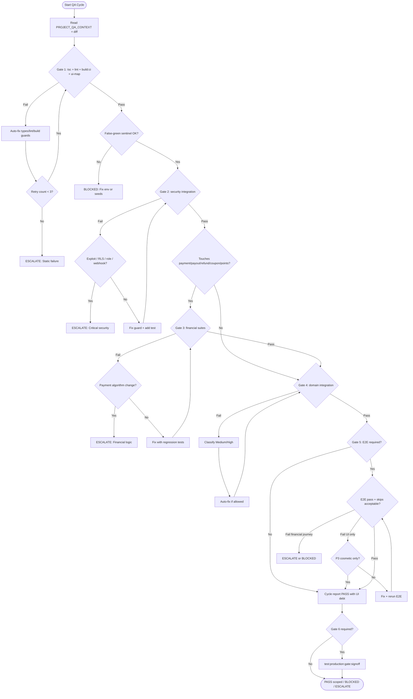

# Autonomous QA Protocol

> **Version:** 1.0  
> **Status:** Production operating manual for Cursor Agent  
> **Discovery SSOT:** [`docs/PROJECT_QA_CONTEXT.md`](../PROJECT_QA_CONTEXT.md)  
> **Feature SSOT:** [`system-feature-registry.md`](./system-feature-registry.md) · [`test-coverage-ssot.md`](./test-coverage-ssot.md)  
> **Package manager:** Bun only — never npm/yarn/pnpm

---

## Document Purpose

This protocol defines how Cursor Agent executes QA **without human intervention** across repeated sessions. It is not a test inventory. It is an **operating system** for:

```text
Discover → Analyze → Prioritize → Attempt Fix → Verify → Regression Test
→ Security Validation → Financial Validation → Repeat Until Stable
```

**Rules for every Cursor session:**

1. Read [`docs/PROJECT_QA_CONTEXT.md`](../PROJECT_QA_CONTEXT.md) first — do not re-audit the repository from scratch.
2. Map every change to affected **P0–P3** surfaces and **HIGH RISK** actions/routes listed in PROJECT_QA_CONTEXT §4–5, §13–14.
3. Never declare PASS if false-green conditions (§9) are detected.
4. Never auto-fix financial/security surfaces without verification gates (§5, §13).
5. Emit a cycle report at session end (§15).

---

## 1. QA Philosophy

### 1.1 Production Safety First

The platform handles **real money** (Stripe), **virtual currency** (points/coupons), **PII** (KYC), and **account sanctions**. A green build does not imply production safety.

| Principle | Meaning | Agent obligation |
|-----------|---------|------------------|
| **Production Safety First** | User harm (financial loss, data leak, wrongful suspension) outweighs velocity | Block release on P0 failure; never skip security/financial gates for speed |
| **Zero False Green** | Exit code 0 with 0 meaningful tests executed is a **failure** | Run false-green checks (§9) before any PASS |
| **Financial Integrity** | Payment/capture/refund/payout/coupon/points FSMs must remain consistent with DB RPC guards | Any touch to `orders.ts`, checkouts, webhook, payout, rewards → financial regression (§7, §8) |
| **Security Before Features** | AuthZ gaps on mutations are release blockers | Suspension bypass, role escalation, cron secret bypass → stop and escalate |
| **Regression Never Optional** | Every fix reruns targeted + related tests | No "fix only" commits without verification |
| **Autonomous Iteration** | Agent loops fix→verify up to retry limit (§12), then escalates | Do not ask human for permission to run existing test commands |

### 1.2 What "Stable" Means

A cycle is **stable** when all of the following hold:

- Gates 1–3 pass for the change scope (§10)
- Gate 4–5 pass when env is available; if env missing, cycle ends **BLOCKED** (not PASS)
- No open P0/P1 issues in the cycle report (§15)
- False-green sentinel checks pass (§9)
- No HIGH RISK file was modified without financial + security validation

**Stable ≠ certified for production.** Full sign-off requires Gate 6 (`test:production:gate:signoff`).

---

## 2. QA Priority Pyramid

Prioritize work top-down. Lower tiers must not consume cycles while upper tiers fail.

### P0 — Production Blockers (Never Ship)

| Domain | Examples in this repo | Primary verification |
|--------|----------------------|----------------------|
| **Security** | RLS bypass, role escalation, `profiles.role` mutation, service_role RPC exposed to client | `test:integration:security`, auth unit tests |
| **Payment** | Stripe PI attach/capture, webhook handler, `payment_capture_status` FSM | `test:integration:stripe:webhook-route`, grading/rewards integration |
| **Refund** | Moderation refund saga, auth grading fail refund, `rpc_finalize_*_refund` | `test:integration:moderation`, grading integration |
| **Capture** | Auth fee / goods capture sagas, void on cancel | `test:integration:grading`, unit capture policy tests |
| **Payout** | FPS batch, Connect transfer, T+3/T+7 holds | `test:integration:fps-payout`, `test:integration:merchant-connect-payout` |
| **Authentication** | Session loss, auth callback, password flows | E2E setup, `member-auth-password` |
| **Authorization** | Admin routes, suspended user mutations, cron without secret | `production-security.integration.test.ts`, cron integration |
| **Database corruption** | Illegal order state transitions, double ledger entries | Order FSM integration, PBT tests |
| **RLS** | Direct table reads where policies were removed (remediation migration) | Security integration, manual RPC path review |

**Decision rule:** Any P0 failure → **STOP release narrative** → fix or escalate → do not proceed to P1 work.

### P1 — Financial Features (Ship Only After P0 Green)

| Domain | Key surfaces | Verification |
|--------|--------------|--------------|
| **Orders** | `app/actions/orders.ts`, member/merchant order RPCs | `test:integration:trading-a2`, order E2E |
| **Checkout** | `checkout.ts`, `member-auth-checkout.ts`, `merchant-checkout.ts` | `test:e2e:rewards-gate`, `test:e2e:member-auth-escrow` |
| **Coupons** | `checkout-coupons.ts`, reserve/release RPCs, stale cron | `test:integration:rewards`, `coupon-pbt`, `test:gate:partial` |
| **Rewards / Points** | `rewards.ts`, `point_ledger`, catalog redeem | `test:integration:rewards`, `member-rewards-redeem` E2E |
| **KYC** | `merchant-kyc.ts`, `admin-kyc.ts`, upload route | `test:integration:kyc` |
| **Moderation** | `admin-moderation.ts`, sanctions, refund preview | `test:integration:moderation`, `test:e2e:moderation-gate` |
| **Escrow** | Member + merchant escrow status enums | `test:auth-escrow:gate`, grading integration |
| **Settlement** | `merchant-finance.ts`, Connect/FPS pipelines | `test:integration:merchant-connect-payout`, fps integration |

**Decision rule:** P1 failure blocks feature release for that domain; may allow unrelated P2 fixes if blast radius is proven isolated (requires explicit diff analysis).

### P2 — Core Journeys (Regression After P0/P1 Touch)

| Domain | Examples | Verification |
|--------|----------|--------------|
| **Marketplace** | Search, storefront, product detail | `test:e2e:nightly:member` subset, partner P-E04/E05 |
| **Trading** | Offers, P2P, buy-now | `member-offer-negotiation`, `tc-m24`, `tc-m20` |
| **Merchant** | Inventory, settings, finance smoke | `test:e2e:nightly:merchant` |
| **Profile** | Settings, public profile, reviews | `public-profile-page`, `tc-m22` |
| **Chat** | Realtime, inbox | `global-chat-realtime`, `test:integration:chat-actions` |
| **Notifications** | Email/push phase gates | `test:email:phase*`, `test:push:phase*` (when area touched) |

**Decision rule:** P2 failures are **High** severity (§4) — auto-fix allowed for non-financial UI/logic; rerun targeted E2E.

### P3 — UI / Polish (Last)

| Domain | Examples | Verification |
|--------|----------|--------------|
| **UI layout/spacing** | Tailwind, shadcn | Visual/partner specs optional |
| **Accessibility** | ARIA, focus | Manual/partner unless regression |
| **Performance** | Load time, bundle | PERF_REPORT docs — not gate blocking |
| **Cosmetic copy** | Labels, empty states | Smoke E2E |

**Decision rule:** P3-only failures → **Low/Cosmetic** — may defer if P0–P2 green; never defer if change touched `app/actions/`, `lib/payments/`, `app/api/stripe/`.

### Priority Assignment Algorithm

```text
1. List files changed in diff
2. If any match PROJECT_QA_CONTEXT §13 (security) or §14 (financial) → minimum P1
3. If change touches webhook, cron, payout, refund, RLS, auth guards → P0
4. If change is components/ only with no contract change → P3
5. When in doubt → assign higher priority
```

---

## 3. Autonomous QA Loop

### 3.1 Cycle Algorithm

Execute phases in order. **Do not skip phases** unless §10 explicitly scopes a "Quick QA" run.

```text
PHASE 0 — DISCOVER
  Read PROJECT_QA_CONTEXT + diff + system-feature-registry row for affected F-* ID
  Output: blast radius map (actions, API routes, RPCs, tests)

PHASE 1 — STATIC (Gate 1)
  bunx tsc --noEmit
  bun run lint
  bun run test:ui:check-map
  bun run build:ci

PHASE 2 — FALSE-GREEN SENTINEL (§9)
  If integration/E2E planned → bun run test:prelaunch:check-env (or domain-specific verify)
  Parse test output: executed count must be > 0 for required suites

PHASE 3 — SECURITY (Gate 2)
  bun run test:integration:security
  Targeted unit: tests/unit/auth/

PHASE 4 — FINANCIAL LOGIC (Gate 3)
  Select domain commands from §14 based on diff
  Minimum for any payment touch: test:gate:partial

PHASE 5 — INTEGRATION (Gate 4)
  Domain integration scripts (rewards, moderation, grading, trading, platform, …)

PHASE 6 — E2E (Gate 5)
  smoke-partial → domain gate (rewards-gate, moderation-gate, member-auth-escrow, …)

PHASE 7 — ANALYZE FAILURES
  Classify severity (§4) → decide fix vs escalate (§5, §13)

PHASE 8 — ATTEMPT FIX (if allowed)
  Apply minimal fix → return to PHASE 1 (not only failed phase)

PHASE 9 — REGRESSION (§8)
  Mandatory related suites for touched domain

PHASE 10 — REPORT (§15)
  Emit cycle summary; set status PASS | BLOCKED | ESCALATE
```

### 3.2 Stopping Criteria

| Condition | Action |
|-----------|--------|
| All required gates pass + false-green clear | **PASS** (scope-appropriate) |
| P0 failure after 3 fix attempts | **ESCALATE** — human review |
| P1 financial failure after 3 attempts | **ESCALATE** — do not auto-patch payment logic |
| Env missing for required integration/E2E | **BLOCKED** — document missing vars from `prelaunch-check-env.sh` |
| False-green detected | **FAIL** — do not claim PASS |
| Change touches §13 escalation list | **ESCALATE before fix** if business rule ambiguous |
| Gate 6 required (release sign-off) | Run `test:production:gate:signoff` — only human can waive |

### 3.3 Scope Profiles

| Profile | Phases | When |
|---------|--------|------|
| **Quick** | 1 + 2 + targeted unit | Docs-only, comment-only (confirm no code) |
| **Standard** | 1–3 + targeted integration | Single non-financial feature |
| **Financial** | 1–6 Gate 3 full + gate:partial | Any checkout/order/reward/payout change |
| **Release** | 1–6 + Gate 6 | Pre-production sign-off |

---

## 4. Failure Classification

| Severity | Definition | Allowed in merge? | Block release? | Auto-fix? | Retry limit | Manual review? |
|----------|------------|-------------------|----------------|----------|-------------|----------------|
| **Critical** | P0 security/financial/data integrity; exploitable; money loss | **No** | **Yes** | **No** (escalate first) | 0 auto-fix on prod paths | **Required** |
| **High** | P1 feature broken; incorrect order/payment state; authZ gap on mutation | **No** | **Yes** | Limited (tests, guards wiring — not algorithm) | 3 | If still failing |
| **Medium** | P2 journey broken; integration fail; non-exploitable logic bug | Conditional | For that feature | **Yes** | 3 | If domain is financial-adjacent |
| **Low** | Partial E2E skip due to fixture; non-core edge case with workaround | Yes with ticket | No | **Yes** | 3 | Optional |
| **Cosmetic** | P3 UI/copy/visual | Yes | No | **Yes** | 2 | No |

### 4.1 Failure → Next Action Matrix

| Failure type | First action | If retry fails |
|--------------|--------------|----------------|
| `tsc` / type error | Auto-fix types/imports | Escalate if touches generated `types/supabase.ts` |
| `lint` | Auto-fix lint | Escalate if rule waiver needed |
| `build:ci` prerender throw | Add/guard `isSupabaseConfigured()` per .cursorrules | Escalate if new route architecture |
| Security integration | Read failure RPC/policy; **do not weaken RLS** | Escalate |
| Webhook / Stripe test | Verify env + saga idempotency | Escalate — payment logic |
| E2E fixture skip | Run seed script (`seed:moderation-e2e`, etc.) | BLOCKED if env unavailable |
| Flaky E2E (1 retry pass) | Log flake; rerun once | Mark Medium; add stability ticket |

---

## 5. Autonomous Fix Policy

### 5.1 Auto-Fix Allowed (No Human Pre-Approval)

| Category | Examples | Post-fix requirement |
|----------|----------|----------------------|
| Safe refactors | Rename, extract helper (non-financial) | Gate 1 + targeted tests |
| Missing null checks | Optional chaining, early return | Gate 1 + unit if exists |
| Type issues | TS errors, import paths | Gate 1 |
| Lint | ESLint autofix | Gate 1 |
| Small logic bugs | Off-by-one in UI state, wrong filter | Gate 1–4 by domain |
| Broken imports | Path fixes | Gate 1 |
| Failed tests | Update test expectation when **product bug confirmed fixed** | Full regression §8 |

### 5.2 Auto-Fix Forbidden Without Explicit Verification

**Do not modify** without human approval **or** passing full Gate 3 + security suite after change:

| Category | Repo locations |
|----------|----------------|
| Payment logic | `lib/payments/*`, `lib/stripe/*`, `app/api/stripe/webhook/route.ts` |
| Financial calculations | `lib/checkout/compute-pricing`, `fn_compute_platform_subsidy`, commission/auth fee |
| Pricing | Checkout breakdown, invoice rows |
| Commission / auth fee config | `admin-settings.ts`, `platform_settings`, `fn_platform_*` |
| Escrow FSM | `lib/auth-escrow/`, `lib/member-order/`, `lib/merchant-order/` |
| Stripe workflow | Payment intent create/attach/capture/void/refund |
| Refund algorithm | `lib/moderation/*refund*`, grading fail sagas |
| Database migrations | `supabase/migrations/*` |
| Permission model | RLS policies, GRANT/REVOKE, `profiles_protect_role` |
| Authentication | `app/actions/auth.ts`, session helpers, auth callback |
| HIGH RISK actions | See PROJECT_QA_CONTEXT §4.2 table |

### 5.3 Fix Discipline

```text
IF change touches forbidden category:
  1. STOP
  2. Write repro + failing test if missing
  3. Propose fix in cycle report
  4. IF human approved OR running full Gate 3 + security + financial regression:
       apply minimal diff
     ELSE:
       ESCALATE
```

---

## 6. Security Validation

Run on **every** change that touches `app/actions/`, `app/api/`, `lib/auth/`, `lib/supabase/`, `supabase/`, or admin routes.

### 6.1 Command Baseline

```bash
bun run test:integration:security
bunx vitest run --config vitest.config.mts tests/unit/auth/
```

### 6.2 Checklist

| Control | What it verifies | Failure meaning | Next action |
|---------|------------------|-----------------|-------------|
| **Authentication** | Valid session required for mutations | Anonymous mutation possible | Add `getUser` / guard; rerun security integration |
| **Authorization** | Admin-only paths reject non-admin | Privilege bypass | Fix `requireAdmin` / RPC `is_admin()` |
| **Role escalation** | `profiles.role` not client-writable | Admin self-grant | **Critical** — revert; verify trigger `profiles_protect_role` |
| **Suspended users** | `moderation_get_account_access_restriction` blocks mutations | Sanctioned user can trade | Wire `requireActiveAuthUser` / `requireActiveApiUser` |
| **Admin routes** | `requireAdminPageAccess` on `/admin/*` | Dashboard leak | Fix layout guard |
| **Server Actions** | HIGH RISK actions use appropriate guards | Direct action abuse | Map action in PROJECT_QA_CONTEXT §4; add guard + test |
| **API routes** | Cron requires secret; uploads authenticated | Unauthorized cron/upload | Fix `CRON_SECRET` check / `requireActiveApiUser` |
| **RLS** | User cannot read/write others' orders/rewards/KYC | Data leak | Fix policy; add integration assertion |
| **SQL injection** | RPC params typed; no raw SQL concat in app | Injection risk | Escalate — use parameterized RPC |
| **Secrets** | No keys in client bundle/logs | Credential exposure | Remove from client; rotate secret (human) |
| **Webhook validation** | Stripe signature verified before mutate | Forged payment events | **Critical** — fix webhook route |
| **CSRF** | Server Actions POST + SameSite cookies | CSRF on mutation | Review Next/Supabase defaults; escalate if custom forms |
| **Replay attack** | Webhook finalize RPCs idempotent | Double capture/refund | Add/idempotency key; rerun webhook integration |
| **Idempotency** | Duplicate webhook/cron safe | Double payout | Fix saga; rerun connect/fps integration |
| **Permission bypass** | service_role RPCs not granted to authenticated | Client calls finalize RPC | Fix GRANT in migration (human for prod DB) |

### 6.3 Known Gaps to Actively Test

From PROJECT_QA_CONTEXT §11.3 — treat as **High** until green:

- Most mutations use `auth.getUser()` only (not `requireActiveAuthUser`)
- `admin-member-orders.ts` dev actions without admin guard
- Upload routes (profile/merchant/kyc) may lack suspension parity with listings upload

**Agent rule:** If PR adds new mutation, default to `requireActiveAuthUser` pattern from `lib/auth/mutation-guard.ts`.

---

## 7. Financial Validation

Run when diff touches payment, order, refund, payout, coupon, points, escrow, or platform financial config.

### 7.1 Command Matrix by Domain

| Domain | Commands |
|--------|----------|
| **Core financial gate** | `bun run test:gate:partial` |
| **Rewards / coupons / points** | `bun run test:integration:rewards` · `bun run test:integration:rewards-matrix` · `bun run test:integration:rewards:pbt` (optional deep) |
| **Grading / capture / refund** | `bun run test:integration:grading` · `bun run test:integration:grading:stripe-smoke` |
| **Moderation refund** | `bun run test:integration:moderation` · `bun run test:integration:moderation:pbt` |
| **Payout FPS** | `bun run test:integration:fps-payout` · `bun run test:fps-payout:gate` |
| **Connect payout** | `bun run test:integration:merchant-connect-payout` |
| **Stripe webhook** | `bun run test:integration:stripe:webhook-route` · `bun run test:integration:connect-routes` |
| **Trading / orders** | `bun run test:integration:trading-a2` |
| **Platform config** | `bun run test:integration:platform` |
| **E2E financial** | `bun run test:e2e:rewards-gate` · `bun run test:e2e:member-auth-escrow` · `bun run test:e2e:stripe-reconcile` |

### 7.2 Financial FSM Checklist

| FSM | States (summary) | Invariant | Failure meaning |
|-----|------------------|-----------|-----------------|
| **Payment** | `none → authorized → … → fully_captured` / `voided` | No capture without authorize; void on cancel | Double charge risk |
| **Capture** | Auth fee vs goods capture sagas | Single finalize per PI | Split-brain payment state |
| **Refund** | `none → processing → refunded` / `failed` | Refund ≤ captured; eligibility windows | Over-refund |
| **Payout (member FPS)** | `none → held → ready → processing → paid` | T+3 hold; frozen on sanction | Early payout |
| **Payout (Connect)** | `pending → held → processing → paid` | T+7 hold; recovery deduction | Over-transfer |
| **Coupon reservation** | available → reserved → used/released | One reserve per checkout; stale cron | Double discount |
| **Coupon release** | reserved → released on void/cancel | service_role release RPCs | Stuck reserve |
| **Reward points** | ledger append-only; balance ≥ 0 | No client-side mint | Points inflation |
| **Escrow (member)** | `payment → custody → grading → shipped → released` | Trigger enforces transitions | Illegal state |
| **Escrow (merchant)** | `pending_payment → … → completed_and_transferred` | RPC-only transitions | Stuck escrow |
| **Merchant settlement** | `merchant_ledgers`, receivables | Commission snapshot at payout | Wrong settlement |
| **Member settlement** | FPS payout_requests batch | Admin batch idempotent | Double batch pay |

### 7.3 Concurrency / Double-Spend Scenarios

When fixing near checkout, payout, or coupon code, **manually reason** about PROJECT_QA_CONTEXT §12 scenarios:

| Scenario | Minimum verification |
|----------|---------------------|
| Double capture | webhook integration + capture policy unit tests |
| Double refund | moderation/grading refund integration |
| Double payout | fps + connect integration |
| Negative balance | points redemption integration |
| Race on offer accept | `test:integration:chat-actions` / trading-a2 |
| Cron vs user action | `test:integration:cron-routes` + domain test |

**Failure on any P0 financial invariant → Critical severity → stop auto-fix.**

---

## 8. Regression Strategy

**No exception:** every fix triggers regression proportional to blast radius.

### 8.1 Minimum Regression by Change Type

| Change type | Targeted | Related integration | Related E2E | Security | Financial | Build |
|-------------|----------|---------------------|-------------|----------|-----------|-------|
| `app/actions/orders.ts` | order unit if exists | `test:integration:trading-a2` | order detail specs | security | gate:partial + grading if auth | build:ci |
| Checkout / Stripe | pricing unit | webhook-route + rewards | rewards-gate / member-auth-escrow | security | full Gate 3 domain set | build:ci |
| Admin moderation | moderation unit | moderation + moderation:pbt | moderation-gate | security | gate:partial | build:ci |
| Admin payout | execute-connect-payout unit | fps-payout + connect-payout | admin-stripe-finance | security | fps-payout:gate | build:ci |
| `lib/auth/*` | auth unit | security + affected domain | smoke-partial | **full security** | if financial action touched | build:ci |
| UI-only component | — | — | partner route if mapped | — | — | build:ci |
| `supabase/migrations` | — | **all Gate 3** + security | smoke at minimum | **required** | **required** | build:ci |

### 8.2 Regression Order

```text
1. bunx tsc --noEmit && bun run lint && bun run build:ci
2. test:integration:security (if backend touched)
3. Domain integration (from §7.1)
4. test:gate:partial (if any P0/P1 financial surface)
5. Targeted E2E (from PROJECT_QA_CONTEXT §9 journey table)
6. test:ui:check-data-contracts (if UI financial rows touched)
```

### 8.3 New Bug Fix Requirement

If bug fix lacks regression test **and** test is reasonably addable:

```text
Add test in same PR domain (integration preferred for financial)
ELSE document in cycle report as REGRESSION_DEBT with P-level
```

Per `.cursorrules`: do not use `test.skip` to fake coverage.

---

## 9. False Green Detection

**Protocol FAIL if any sentinel triggers.** Exit code 0 alone is insufficient.

### 9.1 Sentinels

| Sentinel | Detection method | FAIL action |
|----------|------------------|-------------|
| **Skipped integration suite** | Vitest output: `Tests 0 passed` or all skipped | Run `test:prelaunch:check-env`; BLOCKED until env fixed |
| **describe.skipIf** | Entire file skipped — grep output before run | Do not run command without env; report missing vars |
| **E2E mass skip** | Playwright: high skip count, 0 passed | Verify `E2E_*` vars + seeds (`seed:moderation-e2e`, etc.) |
| **Missing environment** | `prelaunch-check-env.sh` exit 1 | BLOCKED — list missing keys |
| **Conditional skips** | `test.skip(` in spec without project guard | Investigate; fail if financial spec skipped |
| **Silent pass** | Command succeeds but no tests executed | **FAIL** |
| **Fake green CI** | Main CI only runs tsc/lint/build — no DB tests | Document: CI green ≠ production safe |
| **build vs build:ci** | `build` passes but `build:ci` fails | FAIL Gate 1 — prerender unsafe |

### 9.2 Pre-Flight Command

Before integration/E2E batches:

```bash
bun run test:prelaunch:check-env
# For Stripe domains:
bun run test:prelaunch:check-env:stripe
```

For merchant grading E2E:

```bash
bun run verify:merchant-grading-e2e
```

### 9.3 Output Parsing Rules

```text
PASS criteria for vitest integration:
  - "Tests" line shows N passed where N > 0
  - No "0 passed" with skipped = total

PASS criteria for playwright:
  - At least 1 test passed in required spec set
  - Document skip count; if skips > passes for financial gate → FAIL

IF sentinel triggered:
  status = BLOCKED | FALSE_GREEN
  do NOT output 🟢 [PASS]
```

---

## 10. Release Gates

### Gate 1 — Static & Build

| Step | Command | Pass criteria |
|------|---------|---------------|
| Typecheck | `bunx tsc --noEmit` | Zero errors |
| Lint | `bun run lint` | Zero errors |
| UI map | `bun run test:ui:check-map` | Contract valid |
| Prerender-safe build | `bun run build:ci` | Exit 0 without Supabase env |

**Failure:** fix types/lint/build guards → retry (max 3).

### Gate 2 — Security

| Step | Command | Pass criteria |
|------|---------|---------------|
| Production security | `bun run test:integration:security` | All tests pass, none skipped |
| Auth unit | `bunx vitest run --config vitest.config.mts tests/unit/auth/` | Pass |

**Failure:** Critical — see §4.

### Gate 3 — Financial

| Step | Command | Pass criteria |
|------|---------|---------------|
| Partial gate | `bun run test:gate:partial` | Pass, executed > 0 |
| Domain suites | §7.1 commands for touched domains | Pass |

**Failure:** stop auto-fix on payment algorithms → escalate.

### Gate 4 — Integration

| Step | Command | Pass criteria |
|------|---------|---------------|
| Domain integration | e.g. `test:integration:rewards`, `moderation`, `grading`, `trading-a2`, `appendix-a` | Pass; no false-green |
| Cron | `bun run test:integration:cron-routes` (if cron touched) | Pass |

### Gate 5 — E2E

| Step | Command | Pass criteria |
|------|---------|---------------|
| Smoke | `bun run test:e2e:smoke-partial` | Core paths pass |
| Domain gate | rewards-gate / moderation-gate / member-auth-escrow / partner-data-contract as scoped | Pass with acceptable skip ratio (<50% skips for financial gates) |

### Gate 6 — Production Readiness

| Step | Command | Pass criteria |
|------|---------|---------------|
| Full gate | `bun run test:production:gate` | All phases pass |
| Sign-off | `PRODUCTION_GATE_SIGNOFF=1 bun run test:production:gate:signoff` | Includes mutation + admin-grading E2E |
| Staging cert | `bun run test:staging:certify` | SSOT checklist green |

**Note:** Gate 6 is **not in GitHub CI** — human-triggered for release.

### Gate Summary Table

| Gate | Blocks merge to main? | Blocks production deploy? | In CI today? |
|------|----------------------|----------------------------|--------------|
| 1 | Should | Yes | **Yes** (except build:ci) |
| 2 | Should | Yes | **No** |
| 3 | For financial PRs | Yes | Partial (scheduled) |
| 4 | For backend PRs | Yes | Partial (labels/schedule) |
| 5 | For journey PRs | Staging | Partial (nightly) |
| 6 | No | **Yes** | **No** |

---

## 11. Decision Tree



### Quick Reference Decisions

| Situation | Action |
|-----------|--------|
| Build fails | Fix prerender guards, types, imports → retry Gate 1 |
| Security fails | Never weaken RLS; add guard → rerun Gate 2 |
| Payment tests fail | **Stop** auto-fix on saga → escalate |
| Payout tests fail | **Stop** → escalate |
| Coupon/points fail | Fix allowed if not changing `fn_compute_platform_subsidy` / ledger rules |
| Only UI fails | Continue if P0–P2 green; log P3 debt |
| Env missing | BLOCKED — not PASS |
| Flaky E2E once | One retry; then log flake |

---

## 12. Autonomous Retry Policy

### 12.1 Retry Loop

```text
attempt = 0
max_attempts = 3

while attempt < max_attempts:
  run failing gate
  if pass: break

  classify failure (§4)
  if Critical OR forbidden fix (§5.2):
    ESCALATE immediately

  if auto-fix allowed:
    apply minimal fix
    run regression from Gate 1 (not partial reruns only)
  else:
    ESCALATE

  attempt += 1

if still failing:
  ESCALATE with logs + repro + suggested human action
```

### 12.2 Retry Conditions

| Condition | Max retries | Full regression after fix? |
|-----------|---------------|----------------------------|
| Gate 1 static | 3 | Gate 1 only minimum; Gate 2 if backend touched |
| Gate 2 security | 0 auto-fix on Critical; 3 on guard wiring | Yes — Gate 1–2 |
| Gate 3 financial | 0 for algorithm; 3 for test/env fixes | Yes — Gate 1–3 |
| Gate 4 integration | 3 | Yes — domain + Gate 1 |
| Gate 5 E2E flake | 1 extra retry | Rerun failed spec |
| Gate 5 E2E real bug | 3 | Full financial E2E if payment-related |

### 12.3 Escalate Immediately (No Retry)

- Stripe webhook signature bypass
- Role escalation repro
- Double payout / double capture repro
- Migration required for security fix
- Ambiguous business rule (refund eligibility, commission policy)

---

## 13. Human Escalation Rules

Cursor **MUST STOP** and request human review before applying changes when:

| Area | Trigger |
|------|---------|
| **Stripe** | Any change to webhook event handling, PI lifecycle, Connect transfer |
| **Money movement** | FPS batch completion, payout finalize RPCs, ledger writes |
| **Database schema** | New migration, RLS policy change, GRANT/REVOKE |
| **Security** | Auth model, admin check, service_role exposure |
| **Authentication** | Login/register/session/password flow behavior change |
| **Production secrets** | Env var requirements, key rotation |
| **External APIs** | Stripe, Bunny, Resend, OneSignal contract change |
| **Payment calculations** | Checkout breakdown, subsidy, commission, auth fee |
| **Permission system** | Sanctions, suspension, role routing |

### Escalation Message Template

```markdown
🔴 [ESCALATE] <one-line reason>

**Surface:** <file/RPC/route>
**Severity:** Critical | High
**Repro:** <steps or test name>
**Risk:** <user/financial impact>
**Proposed fix:** <minimal description — do not apply without approval>
**Verification needed:** <Gate commands>
```

---

## 14. Suggested QA Commands

**Only existing `package.json` scripts.** Do not invent commands.

### 14.1 Quick QA (~5 min)

Use for: docs-only (verify no code), typo, pure CSS.

```bash
bunx tsc --noEmit
bun run lint
bun run build:ci
bun run test:ui:check-map
```

### 14.2 Standard QA (~15–30 min)

Use for: non-financial backend/frontend feature.

```bash
bunx tsc --noEmit && bun run lint && bun run build:ci && bun run test:ui:check-map
bun run test:prelaunch:check-env
bun run test:integration:security
bunx vitest run --config vitest.config.mts tests/unit/
# Domain pick one:
bun run test:integration:platform
bun run test:integration:trading-a2
bun run test:integration:chat-actions
bun run test:e2e:smoke-partial
```

### 14.3 Financial QA (~45–90 min)

Use for: checkout, orders, rewards, payout, grading, moderation refund.

```bash
bun run test:prelaunch:check-env:stripe
bunx tsc --noEmit && bun run lint && bun run build:ci
bun run test:integration:security
bun run test:gate:partial
bun run test:integration:rewards
bun run test:integration:grading
bun run test:integration:moderation
bun run test:integration:merchant-connect-payout
bun run test:integration:fps-payout
bun run test:integration:stripe:webhook-route
bun run test:e2e:rewards-gate
bun run test:e2e:member-auth-escrow
```

### 14.4 Security QA (~20 min)

Use for: auth, admin, API routes, RLS remediation.

```bash
bunx tsc --noEmit && bun run lint && bun run build:ci
bun run test:prelaunch:check-env
bun run test:integration:security
bunx vitest run --config vitest.config.mts tests/unit/auth/
bun run test:integration:cron-routes
bun run test:integration:upload-routes
bun run test:integration:kyc
```

### 14.5 Release QA (~2–3 hours)

Use for: pre-production sign-off.

```bash
bun run test:prelaunch:check-env:stripe
bun run test:production:gate
# Strict sign-off:
PRODUCTION_GATE_SIGNOFF=1 bun run test:production:gate:signoff
# Staging certification:
bun run test:staging:certify
```

### 14.6 Nightly QA (CI parity)

Use for: broad regression validation.

```bash
bun run test:nightly:coverage
# Or subsets:
bun run test:e2e:nightly:member
bun run test:e2e:nightly:merchant
bun run test:e2e:nightly:admin
bun run test:e2e:nightly:matrix
bun run test:integration:appendix-a
bun run test:integration:cron-routes
```

### 14.7 Domain Gate Shortcuts

| Domain | Command |
|--------|---------|
| Rewards | `bun run test:rewards:gate` |
| Moderation | `bun run test:moderation:gate` |
| Auth escrow | `bun run test:auth-escrow:gate` |
| FPS payout | `bun run test:fps-payout:gate` |
| Announcements | `bun run test:announcements:gate` |
| Partner regression | `bun run test:partner:regression` |
| Prelaunch | `bun run test:prelaunch:gate` |

---

## 15. Continuous Improvement

At **every QA cycle end**, produce this report (markdown in chat or `reports/qa-cycle-<date>.md` if user requests file).

### 15.1 Cycle Report Template

```markdown
## QA Cycle Report — <YYYY-MM-DD> <scope>

### Status
🟢 PASS | 🔴 BLOCKED | 🔴 ESCALATE

### Scope
- **Change summary:** …
- **Priority:** P0 | P1 | P2 | P3
- **Feature IDs:** F-* / J-* / TC-* (from system-feature-registry)

### Gates Executed
| Gate | Result | Notes |
|------|--------|-------|
| 1 Static | PASS/FAIL | |
| 2 Security | PASS/FAIL/SKIP | |
| 3 Financial | PASS/FAIL/SKIP | |
| 4 Integration | PASS/FAIL/SKIP | |
| 5 E2E | PASS/FAIL/SKIP | |
| 6 Production | PASS/FAIL/SKIP | |

### False-Green Checks
- prelaunch-check-env: PASS/FAIL
- Tests executed (not skipped): <counts>

### Issues Found
1. …

### Issues Fixed
1. …

### Issues Remaining
1. …

### Risk Level
Critical | High | Medium | Low

### Regression Summary
- Commands run: …
- New tests added: …

### Coverage Delta
- Integration specs touched: …
- E2E specs touched: …
- Known gaps closed: …
- REGRESSION_DEBT added: …

### Suggested Next Cycle
1. …
```

### 15.2 Feeding Back into SSOT

When cycle discovers new gap:

```text
IF gap is reproducible and high-risk:
  propose row update for test-coverage-ssot.md or PROJECT_QA_CONTEXT §11
  do NOT silently edit SSOT unless user requested doc update
```

### 15.3 Metrics to Track Across Sessions

| Metric | Purpose |
|--------|---------|
| False-green BLOCKED count | Env hygiene |
| ESCALATE count | Human bottleneck |
| P0 retry success rate | Agent safety |
| REGRESSION_DEBT items | Test backlog |
| Flaky E2E list | Stability work |

---

## Appendix A — HIGH RISK Surface Quick Map

From PROJECT_QA_CONTEXT — any change requires Gate 2 + Gate 3 at minimum.

**Server Actions:** `orders.ts`, `merchant-checkout.ts`, `member-auth-checkout.ts`, `buy-now.ts`, `rewards.ts`, `checkout-coupons.ts`, `admin-payouts.ts`, `admin-moderation.ts`, `admin-grading.ts`, `admin-kyc.ts`, `admin-settings.ts`, `merchant-kyc.ts`, `offers.ts`

**API Routes:** `/api/stripe/webhook`, `/api/stripe/connect/*`, all `/api/cron/*`, `/api/kyc/upload-document`, `/api/listings/upload-image`

**Lib:** `lib/payments/*`, `lib/stripe/*`, `lib/member-order/*`, `lib/merchant-order/*`, `lib/auth/mutation-guard.ts`, `lib/auth/require-active-api-user.ts`

---

## Appendix B — CI vs Protocol Gap

| What CI runs today | What protocol requires for safe merge |
|--------------------|---------------------------------------|
| tsc, lint, ui-map, build | Gate 1 (+ prefer `build:ci`) |
| — | Gate 2 security |
| Scheduled: rewards, moderation, fps, nightly | Gate 3–5 by domain |
| — | Gate 6 for production |

**Agent must not equate GitHub CI green with protocol PASS.**

---

## Appendix C — Related Documents

| Document | Use when |
|----------|----------|
| [`docs/PROJECT_QA_CONTEXT.md`](../PROJECT_QA_CONTEXT.md) | Discovery, gaps, commands |
| [`system-feature-registry.md`](./system-feature-registry.md) | Feature F-* scope |
| [`test-coverage-ssot.md`](./test-coverage-ssot.md) | J-*/TC-*/CC-* requirements |
| [`PRODUCTION_GATE.md`](./PRODUCTION_GATE.md) | Gate 6 phase detail |
| [`prelaunch-gate.md`](./prelaunch-gate.md) | Env phases 1a/1b |
| [`e2e.md`](./e2e.md) | E2E env vars |
| [`escrow-payment-policy.md`](./escrow-payment-policy.md) | Financial business rules |
| [`config-contract-registry.md`](./config-contract-registry.md) | Config parity CC-* |

---

*This protocol is the permanent operating manual for Cursor autonomous QA sessions. When in conflict with generic advice, this document and PROJECT_QA_CONTEXT.md prevail.*
